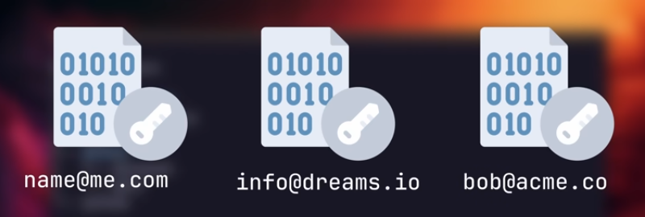

---
layout:
  title:
    visible: true
  description:
    visible: false
  tableOfContents:
    visible: true
  outline:
    visible: true
  pagination:
    visible: true
---

# 🔑 pass - Password Manager

Um gerenciador de senhas simples e seguro para usar direto no terminal

Password Store: [https://www.passwordstore.org](https://www.youtube.com/redirect?event=video\_description\&redir\_token=QUFFLUhqbWdYY09seWl6TTFJajE5SUlzN3lkekxiaW9Ud3xBQ3Jtc0trUjRJQndScWtZQmk0X0NabjlYLUhzWTVBOWZhYVdjVEY5R1FmY1BCLTZwcV9XM3lDa1Z0Tjk1TUptdGpRNXlqWnA1Q01vX0pIbm85NldrRTdxVFFMUlRPbmVzN0dfWkxiM3lRVXU3SW45cHNXdWxuWQ\&q=https%3A%2F%2Fwww.passwordstore.org%2F\&v=FhwsfH2TpFA)\



Este processo foi usando em uma distro ubuntu 22.04 LTS


### Instalar o pass

```sh
sudo apt install pass
```

### Criando um par de chaves gpg


```sh
gpg --gen-key
```


Após preencher os dados da chave informe uma senha mestra.

Ao final ele deve mostrar um resultado parecido com:

```sh
pub   rsa3072 2024-02-06 [SC] [expira: 2026-02-05]
      CB8F2938E10D79FA85E5UEE56B89CCEB789C4876
uid                      Flavio Nunes <admflaviodouglas@gmail.com>
sub   rsa3072 2024-02-06 [E] [expira: 2026-02-05]
```

Anote o ID gerado CB8F2938E10D79FA85E5UEE56B89CCEB789C4876

Caso perder esse ID você pode obte-lo novamente com o comando

```sh
gpg -K
```

Por padrão a chave é gerada com uma data de validade. Para alterar ou remover essa data use o comando:


```sh
gpg --edit-key CB8F2938E10D79FA85E5UEE56B89CCEB789C48767
```


Você deve entrar no prompt interativo **gpg>**\
Siga as instruções abaixo para remover a validade da chave:

* Digite **expire** _\[enter]_
* Escolha a opção **0** (Não expira)  _\[enter]_
* Confirme com **S** _\[enter]_
* Informe a senha mestre da chave _\[enter]_  (pode não ser solicitada)&#x20;
* Digite **save** _\[enter]_

Agora inicie o pass usando o ID da chave


```sh
pass init CB8F2938E10D79FA85E5UEE56B89CCEB789C48767
```


O pass utiliza o git para gerenciar as senhas desse modo o próximo comando é

```sh
pass git init
```

### Tudo pronto, vamos comecar

Já podemos comecar a utilizar o nosso gerenciador de senhas

### Criando um novo segredo


```sh
pass insert github
```


No exemplo acima **github** é o nome do arquivo onde deverá ser armazado o segredo

### Gerando uma nova senha e criando segredo ao mesmo tempo

Um bom exemplo de uso para esse comando é o seguinte cenário: \
Imagine que voce criou uma conta em um novo local e precisa definir uma senha segura para acessar. Para este caso você pode usar o seguinte comando:


```sh
pass generate aws
```


### Visualizando um segredo

```sh
pass show github
pass show aws
```

### Listando todos os segredos criados

Voce pode visualizar todas os segredos criados apenas com o comando:


```sh
pass
```


Nos bastidores o pass armazena os segredos usando o sistema de arquivos, dessa forma tambem podemos visualizar todos os arquivos gerados em:

```sh
ls ~/.password-store
```

Essa carcteristica é muito conveniente tanto para o backup das senhas, quanto para a organização dos segredos.

Por exemplo para organizar melhor nossas informações podemos gravar segredos usando a seguinte estrutura:

```
pass insert github/personal
pass insert github/work
pass generate myproject/oracle/account
```

### Buscando dados

```sh
pass find github
```


Não é aconselhado utilizar email ou nome de usuário como nome do segredo, uma vez que o pass utiliza o sistema de arquivos para gravar o segredo. O nome do segredo fica visivel, então não é uma boa prática


<figure><figcaption><p>Exemplo de como ficaria os arquivos</p></figcaption></figure>

No entanto o pass permite armazenar qualquer tipo de texto ou segredo além de uma senha comum.

### Adicionando mais dados a um segredo

```
pass edit github
```

Ao informar o comando acima ele irá abrir um editor onde voce pode alterar a senha ou adicionar metadados como:


```
my_password_here
email: flavio@evocorp.com.br
```



Imporante deixar a senha principal na primeira linha do arquivo, pois o pass tem um parametro especial que copia a primeira linha do arquivo para area de transferência por x segundos


O pass tambem permite buscar informações dentro dos segredos então você pode fazer algo como:

```sh
pass grep "flavio@evoocorp.com.br"
# or
pass grep "email:"
```

### Copian


### Fontes do tutorial




